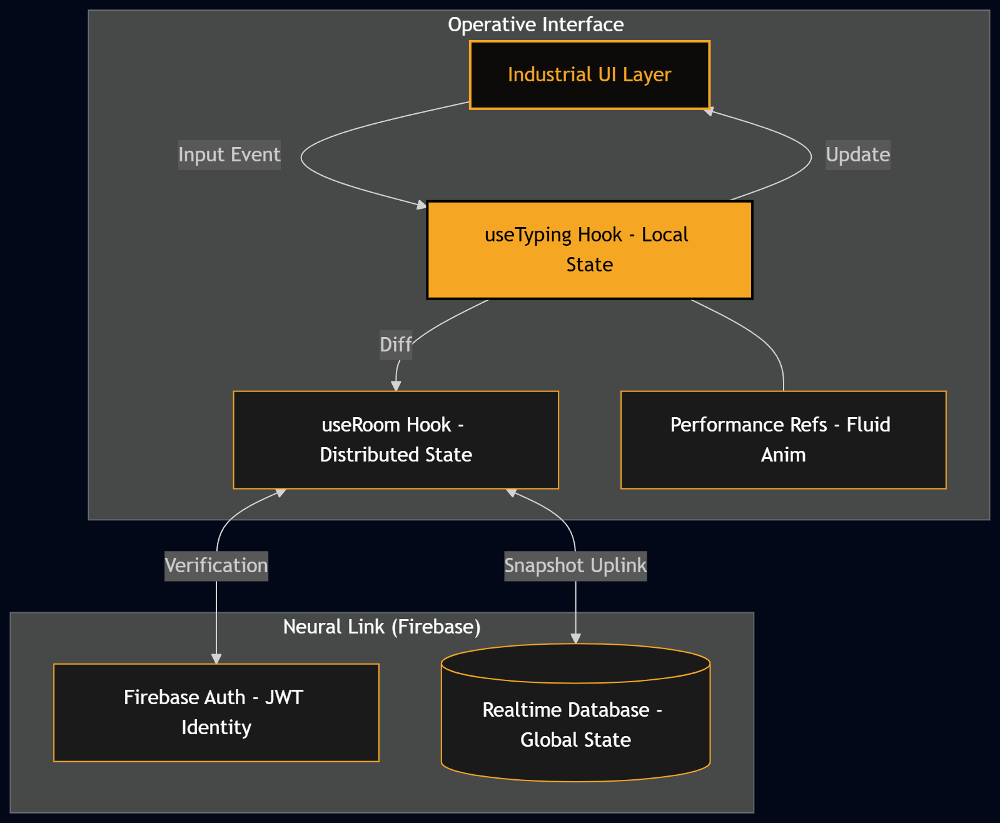

# 🪖 AKSHAR: Tactical Multiplayer Typing Battle

[](https://nextjs.org/)
[](https://firebase.google.com/)
[](https://opensource.org/licenses/MIT)

**AKSHAR** (अक्षर) — *The Imperishable / The Letter*. 

AKSHAR is a high-performance, real-time typing engine built on a distributed state machine. It transforms the mechanical act of typing into a high-stakes tactical hero-racer.

---

## 🗃️ Mission Archives
*Access the full technical blueprints and feature deep-dives.*

### [📂 Sector Technical Archives](./docs/features/README.md)
*Includes: Engine Mechanics, Ability Payloads, UI Architecture, Forensic Insights, and Field Troubleshooting.*

---

## 📐 System Architecture

AKSHAR utilizes a **distributed reactive loop** to maintain sub-100ms synchronization across all clients.



---

## 🧠 Technical Deep-Dive (Engineering Insights)

### 1. The Neural Loop (Distributed State)
Standard typing games suffer from "Network Jitter." AKSHAR solves this using **Optimistic Distributed Progression**:
- **Local Loop**: The `useTyping` hook processes keystrokes instantly, updating the local UI at 60fps for zero-latency feedback.
- **Distributed Loop**: The `useRoom` hook debounces and broadcasts progress updates to Firebase. 
- **Conflict Resolution**: Clients use server-stamped synchronization to resolve race conditions between ability strikes and finishing order.

### 2. Tactical State Machine (Ability Payloads)
Ability effects (Blurs, Flashes, Scrambles) are managed as **Transient Distributed States**:
- **Atomic Operations**: When an operative uses an ability, the targeting matrix identifies the victim and performs an **Atomic Firebase Transaction** to inject the effect payload.
- **Self-Healing Decay**: The client-side `EffectOverlay` monitors the distributed state. Once an effect is cleared (via client-side timeout logic), the global state "decays" back to the baseline profile.

### 3. Forensic Performance & SVG Mapping
We bypassed the Virtual DOM for high-frequency elements to ensure 60fps smooth rendering:
- **SVG Coordinate Mapping**: Performance charts are rendered using calculated SVG polyline paths, ensuring they are infinitely scalable and lightweight.
- **Ref Persistence**: High-frequency animations (like ability charge bars) use **React Refs** to update the DOM directly, preventing the overhead of full React re-renders during intensive typing bouts.

### 4. Decryption Layer (अक्षर Logic)
The iconic "Decryption" effect ($AKSHAR \rightarrow अक्षर$) is implemented using a custom **Phased Text Scrambler**:
- It uses a seeded randomizer to transition characters between Latin, Cyrillic, and Devanagari scripts before settling on the target string, creating the signature "Industrial Decryption" feel.

---

## 🎭 The operatives

| Operative | Tactical Ability (`TAB`) | Passive Protocol |
| :--- | :--- | :--- |
| **🌪️ VAYU** | **Slipstream**: Instantly warp forward 5 words. | 10+ word streak grants a terminal speed multiplier. |
| **🔥 AGNI** | **Rewrite**: Applies a burning blur to an opponent's vision. | Typos cost significantly less momentum (WPM). |
| **🛡️ SUTRA** | **Foretold**: Shields your progress from enemy targeting. | Ancient logic triggers slow auto-corrections on errors. |
| **🐍 VISHA** | **Compound**: Scrambles 3 upcoming words for an enemy. | Toxin aura warns when opponents are within 5 WPM. |
| **🌑 CHHAYA** | **Absence**: Redacts upcoming words, forcing blind typing. | Stealth protocol hides your progress from all rivals. |
| **💥 BIJLI** | **Fault Line**: Blashes an opponent's interface white. | Every ability use overclocks the next charge rate. |
| **🩸 KALI** | **Devour**: Every opponent typo moves them *backwards*. | Total dominance: 15 correct words grant a duration bonus. |
| **🤖 YANTRA** | **Last Tuesday**: Locks an opponent's keyboard for 2s. | Places hidden traps that freeze enemy progress bars. |

---

## 🏁 Deployment Protocol

```bash
# Clone and enter the sector
git clone https://github.com/prasanna192005/not-my-type-valorant.git
cd not-my-type-valorant

# Establish Neural Uplink (.env.local)
NEXT_PUBLIC_FIREBASE_API_KEY=xxx
NEXT_PUBLIC_FIREBASE_AUTH_DOMAIN=xxx
NEXT_PUBLIC_FIREBASE_DATABASE_URL=xxx
NEXT_PUBLIC_FIREBASE_PROJECT_ID=xxx
NEXT_PUBLIC_DEBUG_ACCESS_KEY=admin123

# Engage Uplink
npm install && npm run dev
```

**System established by [Prasanna](https://github.com/prasanna192005) // AKSHAR SYSTEMS**
